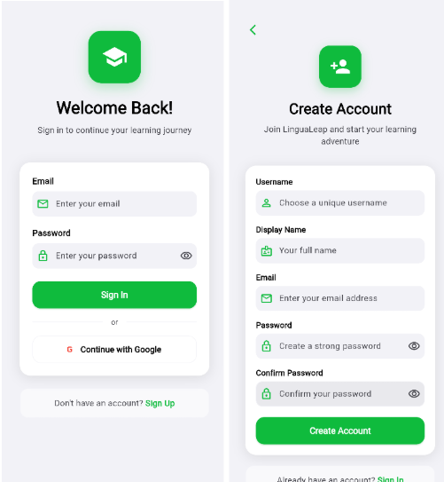
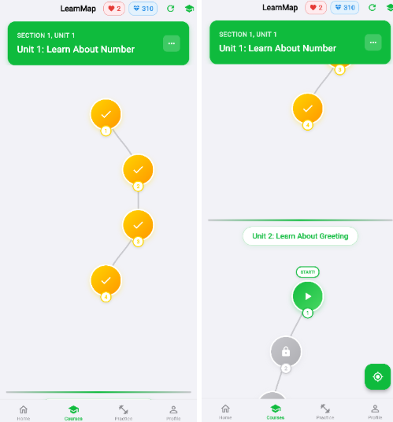
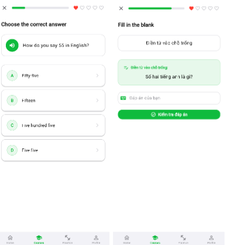
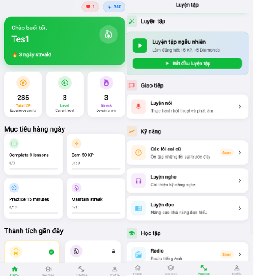

# 📘 LinguaLeap – English Learning App

**LinguaLeap** là ứng dụng học tiếng Anh thông minh được phát triển bằng **Flutter** (frontend) và **Node.js + GraphQL + MongoDB** (backend). Ứng dụng tích hợp **gamification** (XP, streaks, hearts, leaderboard), **AI Exercise Generation**, bản đồ học tương tác, hệ thống khóa học–bài học–bài tập đầy đủ, và quản trị nội dung cho admin. App hỗ trợ Android, iOS và Web với giao diện lấy cảm hứng từ iOS.

> Tài liệu & mã nguồn tham chiếu: báo cáo đồ án (PDF) và 2 repo Flutter/Backend.

---

## ✨ Tính năng chính

### 👤 Người dùng
- **Đăng ký/Đăng nhập** với kiểm tra hợp lệ, **JWT** và lưu **session/auto-login** (SharedPreferences).  
- **Hồ sơ người dùng**: tên hiển thị, avatar, thống kê học tập (XP, streak, cấp độ).  
- **Bản đồ học (Learn Map)** tương tác: Section → Unit → Lesson; trạng thái màu (Locked/Unlocked/In-progress/Completed), **mở khóa thông minh** sau khi hoàn thành bài trước; tích hợp **Hearts** và **đếm ngược hồi phục**.  
- **Làm bài tập đa dạng**: Multiple Choice, Fill-in-the-blank, Translation, Listening, Matching,…; tính điểm theo độ chính xác & độ khó; cộng **XP**/**Diamonds**.  
- **Mục tiêu & thành tích**: Daily goals (số bài, XP, thời gian luyện), achievements kèm animation.  
- **Thi đua/xếp hạng**: **Leaderboard** theo XP & cấp độ.  
- **Quản lý từ vựng** và luyện tập kỹ năng (Reading/Listening/Vocabulary practice).  
- **Cài đặt**: Dark/Light Mode, quản lý tài khoản (đăng xuất, đổi mật khẩu).

### 🛠️ Admin
- **Quản trị nội dung**: CRUD **Course/Unit/Lesson/Exercise** (theme/icon/màu/điều kiện mở khóa).  
- **28 dạng bài tập (exercise subtypes)** với **CRUD** đầy đủ, **chỉ admin** được thao tác. Dữ liệu nội dung dạng **JSON** linh hoạt.  
- **AI Exercise Generation**: sinh bài tập (vocab/grammar) từ input, giúp tạo nội dung nhanh.  

> Ảnh minh họa:  
>   
>    
>   
>   


---

## 🧱 Kiến trúc tổng quan

```
LinguaLeap/
├─ frontend/ (Flutter)
│  └─ lib/
│     ├─ constants/          # Hằng số & config
│     ├─ graphql/            # GQL queries/mutations (auth, courses, exercises,...)
│     ├─ models/             # Data models (User, Course, Unit, Lesson, Exercise,...)
│     ├─ network/            # Services (GraphQL client, AuthService, CourseService,...)
│     ├─ pages/              # UI pages (auth, home, learnmap, admin, practice, settings,...)
│     ├─ routes/             # go_router + StatefulShellRoute
│     ├─ theme/              # App themes (iOS-inspired, dark/light)
│     ├─ utils/              # Helpers, safe navigation
│     └─ widgets/            # Reusable widgets (layouts, components)
│
└─ backend/ (Node.js)
   └─ server/
      ├─ data/models/        # Mongoose schemas (user, course, unit, lesson, exercise,...)
      ├─ graphql/            # Resolvers (auth, learnmap, courses, exercise CRUD,...)
      ├─ utils/              # JWT, AI service, TTS service, etc.
      ├─ config.js           # Kết nối MongoDB Atlas
      └─ index.js            # Entry (Express + GraphQL Yoga)
```

---

## 🧰 Tech Stack

### Frontend (Flutter)
- **Flutter 3.x**, **Dart 3.x**
- **graphql_flutter**, **go_router** (StatefulShellRoute)
- **Provider** (theme/state nhẹ)
- **SharedPreferences** (JWT, theme)
- **iOS-inspired UI** + Dark/Light mode

### Backend (Node.js)
- **Node.js ≥ 18**, **Express.js**
- **GraphQL Yoga** (+ Apollo-compatible)
- **MongoDB Atlas** (Mongoose)
- **JWT + bcrypt** (Auth)
- **Nodemailer** (quên mật khẩu), **Firebase** (lưu trữ – planned)
- **Vercel/Render** (deploy)

---

## ⚙️ Cài đặt & chạy

### 1) Backend
```bash
git clone https://github.com/takiyayoru/lingualeap-backend
cd lingualeap-backend
npm install

# Tạo file .env (ví dụ)
cat > .env << 'EOF'
PORT=4001
NODE_ENV=development
MONGODB_URI=your_mongodb_atlas_uri
JWT_SECRET=your_jwt_secret
JWT_EXPIRES_IN=7d
EOF

npm run dev
# GraphQL Playground: http://localhost:4001/graphql
```

### 2) Frontend
```bash
git clone https://github.com/takiyayoru/lingualeap-flutter
cd lingualeap-flutter
flutter pub get
flutter run
```

### 3) Tài khoản test
- **User**  
  Email: `Tes12@gmail.com` — Password: `123456`
- **Admin**  
  Email: `admin@gmail.com` — Password: `123456`

> (Có script tạo admin & kiểm thử CRUD trong backend: `create_admin_user.js`, `debug_auth.js`.)

---

## 🔌 Ví dụ GraphQL

**Query courses**
```graphql
query {
  courses {
    id
    title
    level
    category
    totalLessons
  }
}
```

**Register**
```graphql
mutation {
  register(input: {
    username: "testuser"
    email: "test@example.com"
    password: "password123"
    displayName: "Test User"
  }) {
    token
    user { id username currentLevel totalXP }
  }
}
```

**Create Exercise (Admin)**
```graphql
mutation CreateExercise($input: CreateExerciseInput!) {
  createExercise(input: $input) {
    success
    message
    exercise { id type exercise_subtype title instruction }
  }
}
```

---

## 🔐 Bảo mật & Quyền hạn
- **JWT** cho xác thực, gửi qua header `Authorization: Bearer <token>`.  
- **Bcrypt** hash mật khẩu.  
- **Phân quyền**: chỉ **admin** mới có quyền **CRUD exercises** và nội dung học.  
- **Validation** đầu-cuối cho input (email, password strength, uniqueness).

---

## 📝 License
MIT — © 2025, Phan Nguyễn Duy Kha
