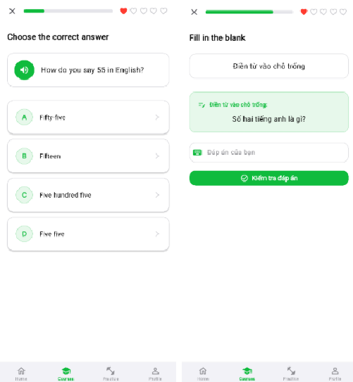

# 📘 LinguaLeap – English Learning App

**LinguaLeap** is an intelligent English learning application developed with **Flutter** (frontend) and **Node.js + GraphQL + MongoDB** (backend). The app integrates **gamification** (XP, streaks, hearts, leaderboard), **AI Exercise Generation**, interactive learning map, comprehensive course-lesson-exercise system, and content management for admins. The app supports Android, iOS, and Web with an iOS-inspired interface.


---

## ✨ Main Features

### 👤 Users
- **Registration/Login** with validation, **JWT** and **session/auto-login** storage (SharedPreferences).  
- **User Profile**: display name, avatar, learning statistics (XP, streak, level).  
- **Interactive Learn Map**: Section → Unit → Lesson; color status (Locked/Unlocked/In-progress/Completed), **smart unlock** after completing previous lessons; integrated **Hearts** and **recovery countdown**.  
- **Diverse exercises**: Multiple Choice, Fill-in-the-blank, Translation, Listening, Matching, etc.; scoring based on accuracy & difficulty; earn **XP**/**Diamonds**.  
- **Goals & achievements**: Daily goals (number of lessons, XP, practice time), achievements with animations.  
- **Competition/ranking**: **Leaderboard** by XP & level.  
- **Vocabulary management** and skill practice (Reading/Listening/Vocabulary practice).  
- **Settings**: Dark/Light Mode, account management (logout, change password).

### 🛠️ Admin
- **Content management**: CRUD **Course/Unit/Lesson/Exercise** (theme/icon/color/unlock conditions).  
- **28 exercise subtypes** with complete **CRUD**, **admin-only** operations. Content data in flexible **JSON** format.  
- **AI Exercise Generation**: generate exercises (vocab/grammar) from input, helps create content quickly.  

> Illustrative images:  
>   
>    
>   
>   

---

## 🧱 Overall Architecture

```
LinguaLeap/
├─ frontend/ (Flutter)
│  └─ lib/
│     ├─ constants/          # Constants & config
│     ├─ graphql/            # GQL queries/mutations (auth, courses, exercises,...)
│     ├─ models/             # Data models (User, Course, Unit, Lesson, Exercise,...)
│     ├─ network/            # Services (GraphQL client, AuthService, CourseService,...)
│     ├─ pages/              # UI pages (auth, home, learnmap, admin, practice, settings,...)
│     ├─ routes/             # go_router + StatefulShellRoute
│     ├─ theme/              # App themes (iOS-inspired, dark/light)
│     ├─ utils/              # Helpers, safe navigation
│     └─ widgets/            # Reusable widgets (layouts, components)
│
└─ backend/ (Node.js)
   └─ server/
      ├─ data/models/        # Mongoose schemas (user, course, unit, lesson, exercise,...)
      ├─ graphql/            # Resolvers (auth, learnmap, courses, exercise CRUD,...)
      ├─ utils/              # JWT, AI service, TTS service, etc.
      ├─ config.js           # MongoDB Atlas connection
      └─ index.js            # Entry (Express + GraphQL Yoga)
```

---

## 🧰 Tech Stack

### Frontend (Flutter)
- **Flutter 3.x**, **Dart 3.x**
- **graphql_flutter**, **go_router** (StatefulShellRoute)
- **Provider** (theme/lightweight state)
- **SharedPreferences** (JWT, theme)
- **iOS-inspired UI** + Dark/Light mode

### Backend (Node.js)
- **Node.js ≥ 18**, **Express.js**
- **GraphQL Yoga** (+ Apollo-compatible)
- **MongoDB Atlas** (Mongoose)
- **JWT + bcrypt** (Auth)
- **Nodemailer** (forgot password), **Firebase** (storage – planned)
- **Vercel/Render** (deploy)

---

## ⚙️ Installation & Setup

### 1) Backend
```bash
git clone https://github.com/takiyayoru/lingualeap-backend
cd lingualeap-backend
npm install

# Create .env file (example)
cat > .env << 'EOF'
PORT=4001
NODE_ENV=development
MONGODB_URI=your_mongodb_atlas_uri
JWT_SECRET=your_jwt_secret
JWT_EXPIRES_IN=7d
EOF

npm run dev
# GraphQL Playground: http://localhost:4001/graphql
```

### 2) Frontend
```bash
git clone https://github.com/takiyayoru/lingualeap-flutter
cd lingualeap-flutter
flutter pub get
flutter run
```

### 3) Test Accounts
- **User**  
  Email: `Tes12@gmail.com` — Password: `123456`
- **Admin**  
  Email: `admin@gmail.com` — Password: `123456`

---

## 🔌 GraphQL Examples

**Query courses**
```graphql
query {
  courses {
    id
    title
    level
    category
    totalLessons
  }
}
```

**Register**
```graphql
mutation {
  register(input: {
    username: "testuser"
    email: "test@example.com"
    password: "password123"
    displayName: "Test User"
  }) {
    token
    user { id username currentLevel totalXP }
  }
}
```

**Create Exercise (Admin)**
```graphql
mutation CreateExercise($input: CreateExerciseInput!) {
  createExercise(input: $input) {
    success
    message
    exercise { id type exercise_subtype title instruction }
  }
}
```

---

## 🔐 Security & Permissions
- **JWT** for authentication, sent via `Authorization: Bearer <token>` header.  
- **Bcrypt** password hashing.  
- **Role-based access**: only **admins** have **CRUD exercises** and learning content permissions.  
- **End-to-end validation** for input (email, password strength, uniqueness).

## 📬 Contact Information

- 👤 **Author**: Phan Nguyen Duy Kha (Takiya Yoru) 
- 📧 Email: [duykhafoot@gmail.com](mailto:duykhafoot@gmail.com)  
- 🌐 GitHub: [TakiyaYoru](https://github.com/takiyayoru)  
- 🔗 LinkedIn: [linkedin.com/in/takiyayoru](https://www.linkedin.com/in/takiyayoru/)  

If you have questions, feedback, or want to collaborate, please contact via the channels above.